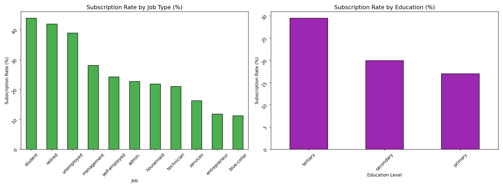

# bank-marketing-analysis
Customer Segmentation &amp; Subscription Prediction using Azure ML | Python | Scikit-learn

# 🏦 Bank Marketing Campaign Analysis
### Customer Segmentation & Subscription Prediction using Azure ML

 

## 📋 Project Overview
This end-to-end data analytics project analyzes a bank's 
marketing campaign data to identify customer segments and 
predict subscription likelihood using machine learning.

**Built for:** Data Analyst / Marketing Analyst Portfolio  
**Platform:** Microsoft Azure Machine Learning  
**Dataset:** UCI Bank Marketing Dataset (45,000+ customers)

---

## 🎯 Business Problem
A bank runs telephone marketing campaigns to sell term deposits. 
The goal is to:
1. Understand which customer segments respond best
2. Predict which customers are likely to subscribe
3. Provide actionable marketing recommendations

---

## 🔬 Project Structure
- **Notebook 1:** Data Cleaning & EDA
- **Notebook 2:** Customer Segmentation (K-Means)
- **Notebook 3:** Subscription Prediction (ML Models)
- **Notebook 4:** Executive Dashboard & Visualizations

---

## 📊 Key Findings

### Customer Segments Discovered
| Segment | Size | Subscription Rate |
|---|---|---|
| High-Value Champions | 1,400 | 30% |
| Promising Youngs | 2,100 | 27% |
| Young Mid-Tier | 2,500 | 15% |
| Over-Contacted | 2,142 | 9% |

### Model Performance
| Model | AUC Score |
|---|---|
| Logistic Regression | 0.856 |
| **Random Forest** | **0.900** ✅ |

### Top Predictors of Subscription
1. 📞 Call Duration
2. 📊 Previous Campaign Outcome
3. 📅 Days Since Last Contact
4. 💰 Account Balance
5. 🎂 Customer Age

---

## 💡 Business Recommendations
1. **Focus on High-Value Champions & Promising Youngs** — 
   3x higher conversion rate
2. **Prioritize call quality over quantity** — 
   longer calls = higher subscription rate
3. **Reduce contacts for Over-Contacted segment** — 
   more calls actually hurts conversion
4. **Target tertiary-educated customers** — 
   30% subscription rate vs 17% for primary

---

## 📈 Visualizations

### Campaign Overview

### Subscription by Segment

### Customer Clusters (PCA)

### Model Comparison

### Marketing Recommendations

---

## 🛠️ Tools & Technologies
- **Platform:** Microsoft Azure Machine Learning
- **Language:** Python 3.10
- **Libraries:** pandas, scikit-learn, matplotlib, seaborn
- **Algorithms:** K-Means Clustering, Random Forest, 
  Logistic Regression
- **Techniques:** EDA, PCA, Feature Engineering, 
  Model Evaluation

---

## 🚀 How to Run
1. Clone this repository
2. Install requirements: `pip install -r requirements.txt`
3. Run notebooks in order (01 → 02 → 03 → 04)

---

## 👤 Author
**Azar Taheri**  
 
🔗 [www.linkedin.com/in/azar-taheri](#)
